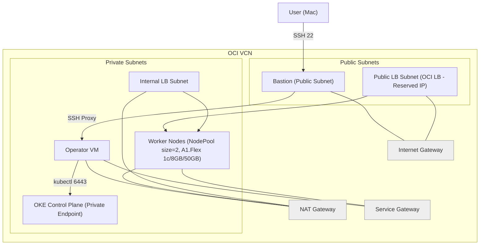

# Terraform OKE for Oracle Cloud Infrastructure

## 專案概述

此專案為 Oracle Cloud Infrastructure (OCI) 提供可重複使用的 Terraform 模組，用於部署 OCI Kubernetes Engine (OKE) 叢集。

## 系統配置規格

### 版本要求
- **Terraform**: >= 1.3.0
- **OCI Provider**: >= 7.6.0
- **Kubernetes**: v1.30.1
- **CNI**: flannel
- **叢集類型**: basic

### 硬體配置

| 配置項目 | 數值 | 說明 |
|---------|------|------|
| **VM Shape** | `VM.Standard.A1.Flex` | ARM 架構的彈性虛擬機 |
| **CPU 核心數** | `1 OCPU` | 每個節點 1 個 OCPU |
| **記憶體** | `6 GB` | 每個節點 6GB 記憶體 |
| **節點數量** | `4 個` | 總共 4 個工作節點 |
| **總 CPU** | `4 OCPUs` | 總計 4 個 OCPU |
| **總記憶體** | `24 GB` | 總計 24GB 記憶體 |
| **處理器架構** | `ARM (Ampere Altra)` | 高效能 ARM 處理器 |

### 網路配置

| 配置項目 | 數值 | 說明 |
|---------|------|------|
| **VCN CIDR** | `10.0.0.0/16` | 虛擬雲端網路 |
| **Pod CIDR** | `10.244.0.0/16` | Pod 網路範圍 |
| **Service CIDR** | `10.96.0.0/16` | Service 網路範圍 |
| **負載平衡器** | `both` | 支援公開和內部負載平衡器 |

### 安全配置

| 配置項目 | 數值 | 說明 |
|---------|------|------|
| **控制平面** | `private` | 私有控制平面 |
| **工作節點** | `private` | 私有工作節點 |
| **SSH 存取** | `enabled` | 透過堡壘主機存取 |
| **網路安全群組** | `enabled` | 自動配置安全規則 |

## 建置步驟

### 架構圖


### 前置準備

1. **安裝必要工具**
```bash
# 安裝 Terraform
# 安裝 OCI CLI
# 安裝 kubectl
```

2. **設定 OCI 認證**
```bash
# 設定 OCI 配置檔案
oci setup config
oci session refresh-tokens --profile-name peoplesystem-v2


# 或使用 API 金鑰
export TF_VAR_api_fingerprint="your_fingerprint"
export TF_VAR_api_private_key_path="~/.oci/oci_api_key.pem"
export TF_VAR_tenancy_id="ocid1.tenancy..."
export TF_VAR_compartment_id="ocid1.compartment..."
```

### 快速部署（建議流程，請勿使用 -target）
```bash
terraform init

# 建議先準備變數檔，避免 SSH 與 NSG 未就緒造成卡住
cp terraform.tfvars.example terraform.tfvars
# 編輯 terraform.tfvars：
# - 將 ssh_public_key_path / ssh_private_key_path 指到你的金鑰
# - 將 bastion_allowed_cidrs 改為你的外網 IP/32（或暫時 0.0.0.0/0 測試）
# - 首次套用建議 operator_await_cloudinit=false，待能連通後再改回 true

terraform plan
terraform apply
```

### 驗證部署

```bash
# 1. 取得 kubeconfig
terraform output -raw kubeconfig > kubeconfig

# 2. 設定 kubectl
export KUBECONFIG=kubeconfig

# 3. 驗證叢集
kubectl get nodes
kubectl get pods --all-namespaces

# 4. 連線檢查（可選）
# 取得 SSH 指令並測試
terraform output -raw ssh_to_bastion
terraform output -raw ssh_to_operator

# 5. 測試部署
kubectl run nginx --image=nginx
kubectl get pods
```

### 常用 Terraform outputs（快速取得關鍵指令與資訊）

```bash
# SSH 連線指令
terraform output -raw ssh_to_bastion
terraform output -raw ssh_to_operator

# 產出 kubeconfig 檔案
terraform output -raw kubeconfig > kubeconfig

# 重要位址/資訊
terraform output -raw bastion_public_ip
terraform output -raw operator_private_ip
terraform output -raw apiserver_private_host
```

### 上線必裝：Ingress NGINX + cert-manager（Let’s Encrypt 自動續期）

以下指令預設在 `operator` 上執行；或你已在本機設定好 `KUBECONFIG` 也可直接在本機執行。

1) 清理先前的 demo 測試（如已建立）
```bash
kubectl delete namespace demo --ignore-not-found
```

2) 安裝 Ingress NGINX（使用預留 IP）
```bash
helm repo add ingress-nginx https://kubernetes.github.io/ingress-nginx
helm repo update

# 方式 A：以固定 IP 直接指定（最簡單）
helm upgrade --install ingress-nginx ingress-nginx/ingress-nginx \
  --namespace ingress-nginx --create-namespace \
  --set controller.service.type=LoadBalancer \
  --set controller.service.loadBalancerIP=$(terraform output -raw service_lb_reserved_ip_address)

# 若後續要使用 cert-manager 的 HTTP-01 驗證，避免 admission webhook 擋下
# solver Ingress（pathType=Exact），建議一併加入：
#   --set controller.admissionWebhooks.failurePolicy=Ignore

# 方式 B：以 Reserved IP OCID 指定（更穩妥）
helm upgrade --install ingress-nginx ingress-nginx/ingress-nginx \
  --namespace ingress-nginx --create-namespace \
  --set controller.service.type=LoadBalancer \
  --set controller.service.annotations."service\.beta\.kubernetes\.io/oci-load-balancer-reserved-ip"="$(terraform output -raw service_lb_reserved_ip_ocid)"

# 亦可加入（配合同上說明）：
#   --set controller.admissionWebhooks.failurePolicy=Ignore

# 建議（最佳相容）：排除 cert-manager HTTP-01 solver Ingress 的驗證
# cert-manager 會在 solver Ingress 上加上標籤 acme.cert-manager.io/http01-solver
# 透過 objectSelector 排除這類資源，避免 webhook 因 pathType=Exact 擋下
helm upgrade --install ingress-nginx ingress-nginx/ingress-nginx \
  --namespace ingress-nginx --create-namespace \
  --set controller.service.type=LoadBalancer \
  --set controller.service.loadBalancerIP=$(terraform output -raw service_lb_reserved_ip_address) \
  --set controller.admissionWebhooks.objectSelector.matchExpressions[0].key=acme.cert-manager.io/http01-solver \
  --set controller.admissionWebhooks.objectSelector.matchExpressions[0].operator=DoesNotExist

# 驗證 EXTERNAL-IP（需等待數十秒）
kubectl -n ingress-nginx get svc ingress-nginx-controller -w
```

3) 安裝 cert-manager 與建立 ClusterIssuer（Let’s Encrypt HTTP-01）
```bash
helm repo add jetstack https://charts.jetstack.io
helm repo update
kubectl create namespace cert-manager --dry-run=client -o yaml | kubectl apply -f -
helm upgrade --install cert-manager jetstack/cert-manager \
  --namespace cert-manager \
  --set crds.enabled=true

cat <<'YAML' | kubectl apply -f -
apiVersion: cert-manager.io/v1
kind: ClusterIssuer
metadata:
  name: letsencrypt-http01
spec:
  acme:
    email: tianyikao@gmail.com
    server: https://acme-v02.api.letsencrypt.org/directory
    privateKeySecretRef:
      name: le-account-key
    solvers:
    - http01:
        ingress:
          class: nginx
YAML
```

如簽發卡在 pending（被 webhook 擋下）可採以下修正：

```bash
# A) 直接用 Helm 更新 ingress-nginx（保留固定 IP）
helm upgrade --install ingress-nginx ingress-nginx/ingress-nginx \
  --namespace ingress-nginx \
  --set controller.service.type=LoadBalancer \
  --set controller.service.loadBalancerIP=$(terraform output -raw service_lb_reserved_ip_address) \
  --set controller.admissionWebhooks.failurePolicy=Ignore

# B) 或臨時 patch 現有 webhook（無需重裝 Helm）
kubectl patch validatingwebhookconfiguration ingress-nginx-admission \
  --type='json' -p='[{"op":"replace","path":"/webhooks/0/failurePolicy","value":"Ignore"}]'

# 刪除當次 request/order/challenge 重新觸發簽發
kubectl -n demo delete certificaterequest peoplesystem-tls-1 || true
kubectl -n demo delete order peoplesystem-tls-1-2629536821 || true
kubectl -n demo delete challenge peoplesystem-tls-1-2629536821-2669759384 || true

# 觀察直到 READY=True
kubectl -n demo get certificate -w
```

4) 最小化範例（含 TLS）：部署 hello 與 Ingress（請替換你的網域）
```bash
cat <<'YAML' | kubectl apply -f -
apiVersion: v1
kind: Namespace
metadata:
  name: demo
---
apiVersion: apps/v1
kind: Deployment
metadata:
  name: hello
  namespace: demo
spec:
  replicas: 1
  selector:
    matchLabels:
      app: hello
  template:
    metadata:
      labels:
        app: hello
    spec:
      containers:
        - name: echo
          image: ealen/echo-server:latest
          ports:
            - containerPort: 80
---
apiVersion: v1
kind: Service
metadata:
  name: hello-svc
  namespace: demo
spec:
  selector:
    app: hello
  ports:
    - port: 80
      targetPort: 80
      protocol: TCP
---
apiVersion: networking.k8s.io/v1
kind: Ingress
metadata:
  name: hello-ing
  namespace: demo
  annotations:
    cert-manager.io/cluster-issuer: letsencrypt-http01
spec:
  ingressClassName: nginx
  tls:
    - hosts:
        - your.domain.example.com
      secretName: your-domain-tls
  rules:
    - host: your.domain.example.com
      http:
        paths:
          - path: /hello
            pathType: Prefix
            backend:
              service:
                name: hello-svc
                port:
                  number: 80
YAML
```

5) 驗證簽發與存取
```bash
# 憑證狀態
kubectl -n demo get certificate
kubectl -n demo describe certificate your-domain-tls

# 瀏覽器或 curl 測試（DNS 已指向預留 IP）
curl -i https://your.domain.example.com/hello
```

6) 清理 demo 範例（完成驗證後）
```bash
kubectl delete namespace demo --ignore-not-found
```

### Ingress 範本：Jenkins（default 命名空間，使用 peoplesystem-tls）

```yaml
apiVersion: networking.k8s.io/v1
kind: Ingress
metadata:
  name: jenkins-ingress
  namespace: default
  annotations:
    cert-manager.io/cluster-issuer: letsencrypt-http01
spec:
  ingressClassName: nginx
  tls:
    - hosts:
        - peoplesystem.tatdvsonorth.com
      secretName: peoplesystem-tls
  rules:
    - host: peoplesystem.tatdvsonorth.com
      http:
        paths:
          - path: /jenkins
            pathType: Prefix
            backend:
              service:
                name: jenkins-service
                port:
                  number: 8080
```

提示：請確保 Jenkins 服務本身支援子路徑 /jenkins（例如以 `JENKINS_OPTS=--prefix=/jenkins` 啟動或將 Root URL 設為 `https://peoplesystem.tatdvsonorth.com/jenkins`）。

### 共享 RWO PVC（單節點）：Jenkins 與其他服務共用 `shared-pvc-1`

RWO 限制：同一時間只能掛載到同一台節點。

1) 將 Jenkins 所在節點打標籤，並固定 Jenkins 到該節點
```bash
# 找出 Jenkins Pod 所在節點
kubectl -n default get pod -l app=jenkins -o wide
# 以回傳的 NODE 值為例打標籤（請替換為你的節點名稱或 IP 顯示名）
kubectl label node <YOUR_NODE_NAME> shared-pvc=true --overwrite

# 若 Jenkins 已建立，用 patch 固定到該節點
kubectl -n default patch deploy jenkins --type merge -p '{
  "spec":{"template":{"spec":{"nodeSelector":{"shared-pvc":"true"}}}}
}'

# 若尚未建立 Jenkins，請在 Deployment 的 spec.template.spec 內加入：
# nodeSelector:
#   shared-pvc: "true"
```

2) 讓其他服務共用同一顆 PVC：使用 `claimName: shared-pvc-1` 並以 `subPath` 區隔
```bash
kubectl apply -f - <<'YAML'
apiVersion: apps/v1
kind: Deployment
metadata:
  name: redis
  namespace: default
  labels:
    app: redis
spec:
  replicas: 1
  selector:
    matchLabels:
      app: redis
  template:
    metadata:
      labels:
        app: redis
    spec:
      nodeSelector:
        shared-pvc: "true"
      initContainers:
        - name: init-redis-subdir
          image: busybox:1.36
          command: ["/bin/sh","-c"]
          args: ["mkdir -p /shared/redis && chown -R 999:999 /shared/redis || true"]
          volumeMounts:
            - name: shared-pvc
              mountPath: /shared
      containers:
        - name: redis
          image: redis:7.2-alpine
          command: ["redis-server"]
          args:
            - "--requirepass"
            - "$(REDIS_PASSWORD)"
            - "--appendonly"
            - "yes"
            - "--maxmemory"
            - "128mb"
            - "--maxmemory-policy"
            - "allkeys-lru"
          env:
            - name: REDIS_PASSWORD
              valueFrom:
                secretKeyRef:
                  name: redis-secret
                  key: redis-password
          ports:
            - containerPort: 6379
          resources:
            requests:
              cpu: "100m"
              memory: "128Mi"
            limits:
              cpu: "200m"
              memory: "256Mi"
          volumeMounts:
            - name: shared-pvc
              mountPath: /data
              subPath: redis
      volumes:
        - name: shared-pvc
          persistentVolumeClaim:
            claimName: shared-pvc-1
---
apiVersion: v1
kind: Service
metadata:
  name: redis
  namespace: default
spec:
  selector:
    app: redis
  ports:
    - port: 6379
      targetPort: 6379
  type: ClusterIP
YAML
```

注意：共用 RWO 卷時，所有同時掛載該卷的 Pod 必須在同一節點；如需跨節點同時掛載，請改用 RWX（例如 OCI FSS + CSI）。

### 安裝 NGINX Ingress Controller（使用預留 IP）

前提：請先透過 SSH 到 `operator` 執行以下指令，或已在本機設定 `KUBECONFIG`。

1) 取得預留 IP（可選，便於帶入指令）
```bash
terraform output -raw service_lb_reserved_ip_address
terraform output -raw service_lb_reserved_ip_ocid
```

2) 安裝 ingress-nginx 並綁定預留 IP
```bash
helm repo add ingress-nginx https://kubernetes.github.io/ingress-nginx
helm repo update

# 方式 A：以固定 IP 直接指定（最簡單）
helm upgrade --install ingress-nginx ingress-nginx/ingress-nginx \
  --namespace ingress-nginx --create-namespace \
  --set controller.service.type=LoadBalancer \
  --set controller.service.loadBalancerIP=$(terraform output -raw service_lb_reserved_ip_address)

# 方式 B：以 Reserved IP OCID 註解指定（更穩妥）
helm upgrade --install ingress-nginx ingress-nginx/ingress-nginx \
  --namespace ingress-nginx --create-namespace \
  --set controller.service.type=LoadBalancer \
  --set controller.service.annotations."service\.beta\.kubernetes\.io/oci-load-balancer-reserved-ip"="$(terraform output -raw service_lb_reserved_ip_ocid)"
```

3) 驗證 Service 是否取得預留 IP
```bash
kubectl -n ingress-nginx get svc ingress-nginx-controller -w
# 期待 EXTERNAL-IP 顯示為預留 IP（例如 140.245.53.95）
```

說明：
- 建立 OCI LB 需要等待數十秒到數分鐘；`-w` 會持續觀察直到 EXTERNAL-IP 就緒。

#### 綁定既有 OCI Load Balancer（指定 OCID 建立 ingress-nginx-controller Service）

若你已有一顆固定的 OCI LB（Reserved IP），可用下列方式將 ingress 綁到該 LB 上（會短暫中斷 80/443）：

```bash
kubectl apply -f - <<'YAML'
apiVersion: v1
kind: Service
metadata:
  name: ingress-nginx-controller
  namespace: ingress-nginx
  annotations:
    oci.oraclecloud.com/load-balancer-id: "<YOUR_LB_OCID>" # 例：ocid1.loadbalancer.oc1...
  labels:
    app.kubernetes.io/name: ingress-nginx
    app.kubernetes.io/instance: ingress-nginx
    app.kubernetes.io/component: controller
spec:
  type: LoadBalancer
  ports:
    - name: http
      port: 80
      protocol: TCP
      targetPort: http
    - name: https
      port: 443
      protocol: TCP
      targetPort: https
    - name: tcp-5432 # 如需透過 ingress 轉發 Postgres（選用）
      port: 5432
      protocol: TCP
      targetPort: 5432
  selector:
    app.kubernetes.io/name: ingress-nginx
    app.kubernetes.io/instance: ingress-nginx
    app.kubernetes.io/component: controller
YAML

# 檢查 IP 與連線
kubectl -n ingress-nginx get svc ingress-nginx-controller -o wide
```

注意：
- 請到 OCI 主控台將該 LB 綁定的 NSG 放行 TCP 80/443（以及 5432 若使用 TCP 轉發）。
- DNS A 記錄需指向該 LB 的 EXTERNAL-IP。

<!-- moved to README-private.md: Upload .png files via bastion/operator to node /images/people -->

### 清理資源

```bash
# 銷毀所有資源
terraform destroy

# 確認銷毀
terraform destroy -auto-approve
```


### 取得支援
- [官方文件](https://oracle-terraform-modules.github.io/terraform-oci-oke/)
- [GitHub Issues](https://github.com/oracle-terraform-modules/terraform-oci-oke/issues)

## 授權

Copyright (c) 2017, 2024 Oracle Corporation and/or its affiliates. Licensed under the [Universal Permissive License 1.0](./LICENSE).
