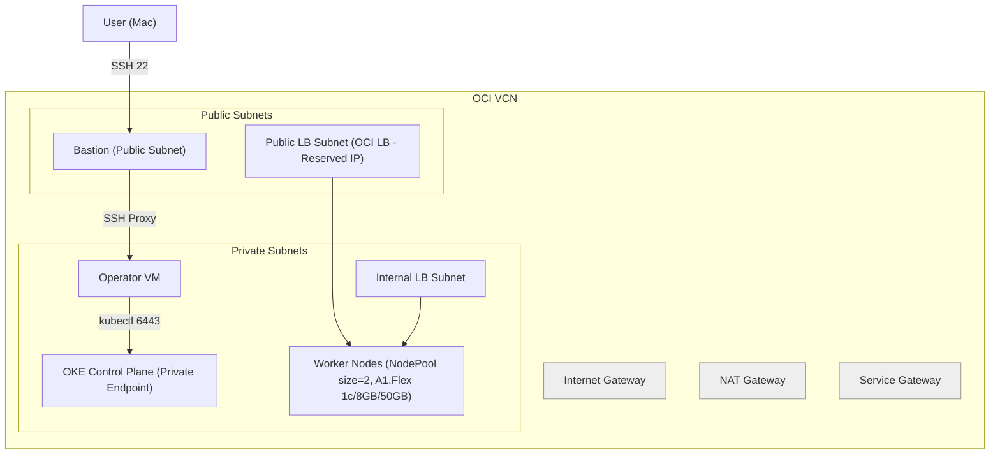

# Terraform OKE for Oracle Cloud Infrastructure

## 專案概述

此專案為 Oracle Cloud Infrastructure (OCI) 提供可重複使用的 Terraform 模組，用於部署 OCI Kubernetes Engine (OKE) 叢集。

## 系統配置規格

### 版本要求
- **Terraform**: >= 1.3.0
- **OCI Provider**: >= 7.6.0
- **Kubernetes**: v1.29.1
- **CNI**: flannel
- **叢集類型**: basic

### 硬體配置

| 配置項目 | 數值 | 說明 |
|---------|------|------|
| **VM Shape** | `VM.Standard.A1.Flex` | ARM 架構的彈性虛擬機 |
| **CPU 核心數** | `1 OCPU` | 每個節點 1 個 OCPU |
| **記憶體** | `6 GB` | 每個節點 6GB 記憶體 |
| **節點數量** | `4 個` | 總共 4 個工作節點 |
| **總 CPU** | `4 OCPUs` | 總計 4 個 OCPU |
| **總記憶體** | `24 GB` | 總計 24GB 記憶體 |
| **處理器架構** | `ARM (Ampere Altra)` | 高效能 ARM 處理器 |

### 網路配置

| 配置項目 | 數值 | 說明 |
|---------|------|------|
| **VCN CIDR** | `10.0.0.0/16` | 虛擬雲端網路 |
| **Pod CIDR** | `10.244.0.0/16` | Pod 網路範圍 |
| **Service CIDR** | `10.96.0.0/16` | Service 網路範圍 |
| **負載平衡器** | `both` | 支援公開和內部負載平衡器 |

### 安全配置

| 配置項目 | 數值 | 說明 |
|---------|------|------|
| **控制平面** | `private` | 私有控制平面 |
| **工作節點** | `private` | 私有工作節點 |
| **SSH 存取** | `enabled` | 透過堡壘主機存取 |
| **網路安全群組** | `enabled` | 自動配置安全規則 |

## 建置步驟

### 架構圖


### 前置準備

1. **安裝必要工具**
```bash
# 安裝 Terraform
# 安裝 OCI CLI
# 安裝 kubectl
```

2. **設定 OCI 認證**
```bash
# 設定 OCI 配置檔案
oci setup config
oci session authenticate --profile peoplesystem-v2 --region ap-singapore-2
oci session refresh-tokens --profile-name peoplesystem-v2


# 或使用 API 金鑰
export TF_VAR_api_fingerprint="your_fingerprint"
export TF_VAR_api_private_key_path="~/.oci/oci_api_key.pem"
export TF_VAR_tenancy_id="ocid1.tenancy..."
export TF_VAR_compartment_id="ocid1.compartment..."
```

### 快速部署（目前使用的方法）
```bash
terraform init
terraform plan
terraform apply
```

### 驗證部署

```bash
# 1. 取得 kubeconfig
terraform output -raw kubeconfig > kubeconfig

# 2. 設定 kubectl
export KUBECONFIG=kubeconfig

# 3. 驗證叢集
kubectl get nodes
kubectl get pods --all-namespaces

# 4. 測試部署
kubectl run nginx --image=nginx
kubectl get pods
```

### 清理資源

```bash
# 銷毀所有資源
terraform destroy

# 確認銷毀
terraform destroy -auto-approve
```


### 取得支援
- [官方文件](https://oracle-terraform-modules.github.io/terraform-oci-oke/)
- [GitHub Issues](https://github.com/oracle-terraform-modules/terraform-oci-oke/issues)

## 授權

Copyright (c) 2017, 2024 Oracle Corporation and/or its affiliates. Licensed under the [Universal Permissive License 1.0](./LICENSE).
