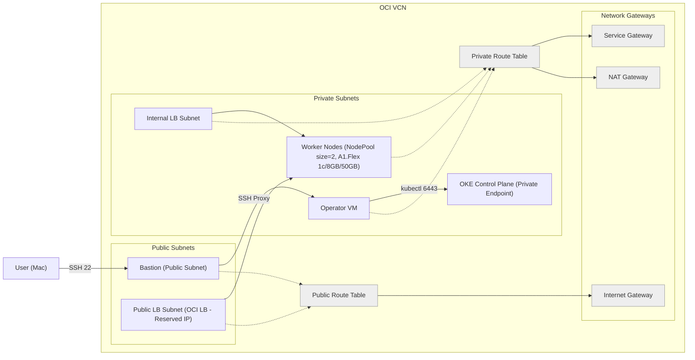

# Terraform OKE for Oracle Cloud Infrastructure

## 專案概述

此專案為 Oracle Cloud Infrastructure (OCI) 提供可重複使用的 Terraform 模組，用於部署 OCI Kubernetes Engine (OKE) 叢集。

## 系統配置規格

### 版本要求
- **Terraform**: >= 1.3.0
- **OCI Provider**: >= 7.6.0
- **Kubernetes**: v1.30.1
- **CNI**: flannel
- **叢集類型**: basic

### 硬體配置

| 配置項目 | 數值 | 說明 |
|---------|------|------|
| **VM Shape** | `VM.Standard.A1.Flex` | ARM 架構的彈性虛擬機 |
| **CPU 核心數** | `1 OCPU` | 每個節點 1 個 OCPU |
| **記憶體** | `6 GB` | 每個節點 6GB 記憶體 |
| **節點數量** | `4 個` | 總共 4 個工作節點 |
| **總 CPU** | `4 OCPUs` | 總計 4 個 OCPU |
| **總記憶體** | `24 GB` | 總計 24GB 記憶體 |
| **處理器架構** | `ARM (Ampere Altra)` | 高效能 ARM 處理器 |

### 網路配置

| 配置項目 | 數值 | 說明 |
|---------|------|------|
| **VCN CIDR** | `10.0.0.0/16` | 虛擬雲端網路 |
| **Pod CIDR** | `10.244.0.0/16` | Pod 網路範圍 |
| **Service CIDR** | `10.96.0.0/16` | Service 網路範圍 |
| **負載平衡器** | `both` | 支援公開和內部負載平衡器 |

### 安全配置

| 配置項目 | 數值 | 說明 |
|---------|------|------|
| **控制平面** | `private` | 私有控制平面 |
| **工作節點** | `private` | 私有工作節點 |
| **SSH 存取** | `enabled` | 透過堡壘主機存取 |
| **網路安全群組** | `enabled` | 自動配置安全規則 |

## 架構圖


```mermaid
flowchart LR
  user["User (Mac)"] -->|SSH 22| bastion["Bastion (Public Subnet)"]

  subgraph OCI VCN
    direction LR

    subgraph Public["Public Subnets"]
      bastion
      pubLB["Public LB Subnet (OCI LB - Reserved IP)"]
    end

    subgraph Private["Private Subnets"]
      operator["Operator VM"]
      cp["OKE Control Plane (Private Endpoint)"]
      workers["Worker Nodes (NodePool size=2, A1.Flex 1c/8GB/50GB)"]
      intLB["Internal LB Subnet"]
    end

    subgraph Gateways["Network Gateways"]
      ig["Internet Gateway"]:::net
      nat["NAT Gateway"]:::net
      sg["Service Gateway"]:::net
    end

    pubRT["Public Route Table"]:::net --> ig
    privRT["Private Route Table"]:::net --> nat
    privRT --> sg

    bastion -.-> pubRT
    pubLB -.-> pubRT

    operator -.-> privRT
    workers -.-> privRT
    intLB -.-> privRT
  end

  bastion -->|SSH Proxy| operator
  operator -->|kubectl 6443| cp
  pubLB --> workers
  intLB --> workers

  classDef net fill:#eee,stroke:#999;
```

## Windows SSH 快速連線

設定 `~/.ssh/config` 後可直接使用：

```
Host oke-bastion
  HostName 140.245.61.250
  User opc
  IdentityFile ~/.ssh/id_ed25519
  IdentitiesOnly yes

Host oke-node
  HostName 10.0.0.69
  User opc
  IdentityFile ~/.ssh/id_ed25519
  IdentitiesOnly yes
  ProxyJump oke-bastion
```

連線指令：`ssh oke-node`

## Kubernetes 服務清單

| 服務 | URL/Namespace | 說明 |
|------|--------------|------|
| Keycloak | `peoplesystem.tatdvsonorth.com/sso` | 身份認證（realm: master, PeopleSystem） |
| Jenkins | `peoplesystem.tatdvsonorth.com/jenkins` | CI/CD（已接 Keycloak SSO + TOTP） |
| Backend | `peoplesystem.tatdvsonorth.com/tymb` | Spring Boot API |
| Frontend | `peoplesystem.tatdvsonorth.com/tymultiverse` | Astro 前端 |
| Maya Sawa | `peoplesystem.tatdvsonorth.com/maya-sawa` | FastAPI AI 服務 |

> Terraform 部署流程、Ingress 設定、Jenkins SSO、Keycloak TOTP、Object Storage 操作指令請見 [AGENTS.md](AGENTS.md)。

## 授權

Copyright (c) 2017, 2024 Oracle Corporation and/or its affiliates. Licensed under the [Universal Permissive License 1.0](./LICENSE).
